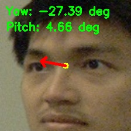
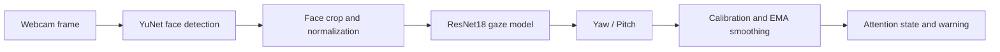

# Real-Time Gaze Monitoring


웹캠 영상에서 얼굴을 검출하고 시선의 yaw/pitch를 실시간으로 추정해 운전자의 전방 주시 이탈을 감지하는 연구 프로토타입입니다. 직접 학습한 gaze domain generalization 모델을 실제 운전자 모니터링 시나리오에 연결했습니다.

> The gaze model is part of ongoing, unpublished research. Training data, training code, and benchmark results are intentionally not included at this stage.



## Why this project?

시선 추정 모델의 단순 정확도 평가에서 끝내지 않고, 실제 제품에서 필요한 요소를 함께 구현하는 데 초점을 맞췄습니다.

- 실시간 얼굴 검출 및 tracking 안정화
- 개인별 정면 시선 캘리브레이션
- 시선각 smoothing과 지속 시간 기반 경고
- 얼굴 미검출 상태 처리
- CPU/GPU 자동 선택 및 실시간 FPS 표시

활용 가능 분야는 driver monitoring system(DMS), 작업자 안전 모니터링, HCI, attention-aware interface 등입니다.

## System overview



## Demo features

| Feature | Description |
|---|---|
| Face detection | OpenCV YuNet detector |
| Gaze estimation | ResNet18 regression head predicting yaw and pitch |
| Calibration | 30-frame personal forward-gaze baseline |
| Attention logic | Angular threshold + dwell time |
| Stabilization | Bounding-box and gaze EMA smoothing |
| Runtime | Webcam input, CPU/CUDA auto selection |

## Quick start

### 1. Install

```bash
git clone https://github.com/dlgkrwls/gaze-monitoring.git
cd Gaze-monitoring

python -m venv .venv
```

Windows:

```powershell
.\.venv\Scripts\Activate.ps1
python -m pip install --upgrade pip
pip install -r requirements.txt
```

macOS/Linux:

```bash
source .venv/bin/activate
python -m pip install --upgrade pip
pip install -r requirements.txt
```

### 2. Prepare model files

The public YuNet face detector is included. The gaze checkpoint is part of ongoing research and is not distributed in this repository. To run gaze inference, place a compatible checkpoint at:

```text
model_epoch_100.pth
```

The expected face-detector path is:

```text
models/face_detection_yunet_2023mar.onnx
```

### 3. Run

```bash
python real_time_facedetector.py
```

If the wrong webcam opens, set the camera index before running:

```powershell
$env:GAZE_CAMERA_INDEX="1"
python real_time_facedetector.py
```

Controls:

- `C`: calibrate while looking straight ahead
- `R`: reset warning count
- `Q`: quit

For a simple center-ROI demo:

```bash
python realtime_manual_roi.py
```

## Attention-state logic

After calibration, the current gaze is compared with the personal forward-gaze baseline. A warning is raised only when the angular deviation persists, which reduces alerts caused by short natural eye movements.

Default prototype settings:

- yaw threshold: ±15°
- pitch threshold: ±12°
- warning delay: 1.5 seconds
- recovery time: 0.5 seconds

These values are demonstration settings, not validated automotive safety requirements.

## Repository structure

```text
.
├── real_time_facedetector.py  # Main driver-monitoring demo
├── realtime_manual_roi.py     # Minimal center-ROI webcam demo
├── test.py                    # Single-image inference example
├── model.py                   # ResNet gaze model factory
├── models/                    # YuNet face detector
└── img/                       # README/demo images
```

> `model_epoch_100.pth` is intentionally excluded from Git and is required only for local gaze inference.

## Technical notes

- Input: RGB face crop, `224 × 224`
- Backbone: ImageNet-style ResNet18
- Output: two continuous values, yaw and pitch in radians
- Face detector: YuNet ONNX model through OpenCV
- Inference: PyTorch `inference_mode`

## Limitations and responsible use

- This is a research prototype, not a certified safety system.
- Performance can degrade under occlusion, extreme head pose, poor illumination, unusual camera placement, or domains not represented during training.
- Webcam frames are processed locally and are not intentionally saved or transmitted by the demo.
- Do not use the output as the sole basis for safety-critical, employment, medical, or surveillance decisions.
- Dataset details and quantitative evaluation will be added after the associated paper process permits disclosure.

## Roadmap

- [ ] Publish evaluation protocol and cross-domain results after paper review
- [ ] Add configuration file and command-line options
- [ ] Export the gaze model to ONNX
- [ ] Add recorded-video inference and structured event logging
- [ ] Benchmark CPU/GPU latency across devices

## Citation

The related paper is currently under review. Citation information will be added after publication.

## License

No open-source license has been selected yet. The source code and model weights remain all rights reserved unless a separate license is added. For research or commercial-use inquiries, contact the repository owner.
